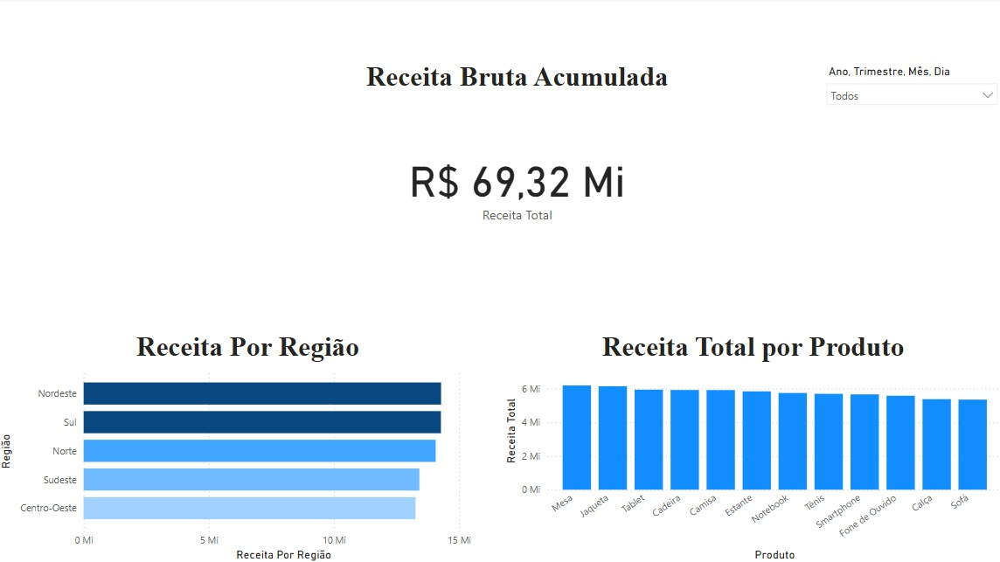

# 📊 Projeto de Análise de Vendas com Power BI

## 📌 Sobre o Projeto
Este projeto consiste na análise de dados de vendas utilizando **Power BI, Excel e DAX**. O objetivo é visualizar insights sobre a performance de produtos, regiões e vendedores.

## 🔧 Tecnologias Utilizadas
- **Power BI** (Criação de dashboards e medidas DAX)
- **Excel** (Armazenamento dos dados)
- **Python** (Geração dos dados fictícios)

## 📊 Análises Realizadas
- Receita total de vendas
- Ticket médio por venda
- Receita por região e por produto
- Segmentação por período

## 📂 Arquivos no Repositório
- **dados_vendas.xlsx** → Arquivo com os dados utilizados

## 🏆 Resultado Final

---
